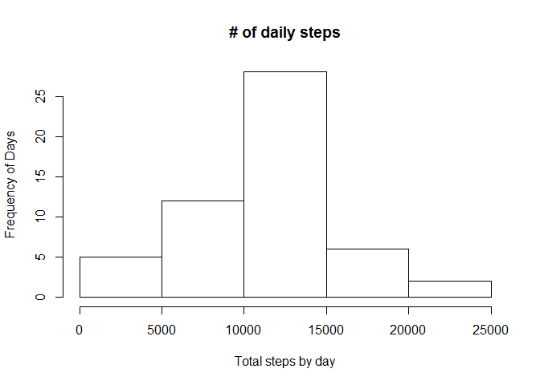
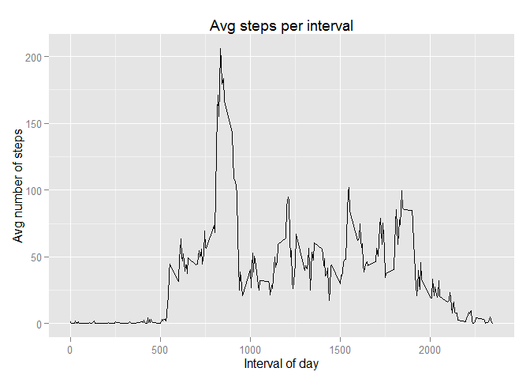
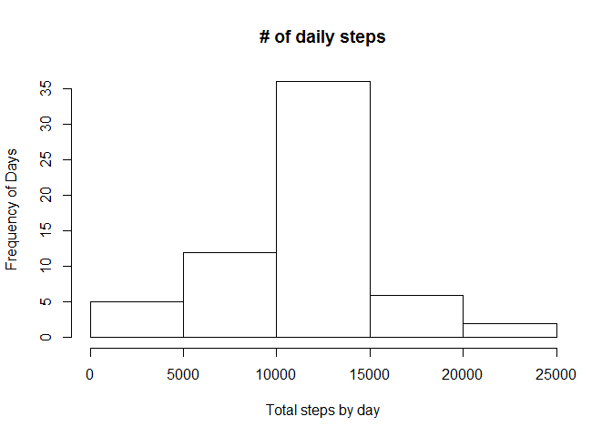
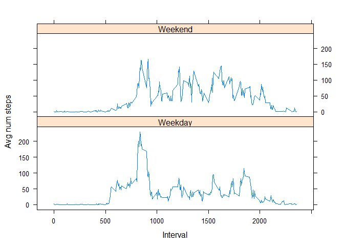

# Reproducible Research: Peer Assessment 1


## Loading and preprocessing the data

### Steps
1. assuming the file does not exist, download the file
2. unzip the file
3. read the csv into an object named data
4. convert date to a Date


```r
    # setInternet2 is required to use knitr download with windows
    setInternet2(use = TRUE)

    filename = "assignment1-data.zip"
    if (!file.exists(filename)) {
        download.file(
            url="https://d396qusza40orc.cloudfront.net/repdata%2Fdata%2Factivity.zip",
            destfile = filename,
            method = "internal")
        unzip(filename) 
    }
    
    data = read.csv("activity.csv", header=TRUE)
    data$date = as.Date(data$date)
```

## What is mean total number of steps taken per day?


```r
library(dplyr)
tot_steps_by_day = group_by(data[complete.cases(data),], date) %>% summarise(tot_steps=sum(steps))
hist(tot_steps_by_day$tot_steps, xlab="Total steps by day", ylab="Frequency of Days",main="# of daily steps")
```

 

```r
mean(tot_steps_by_day$tot_steps, na.rm = TRUE)
```

```
## [1] 10766.19
```

```r
median(tot_steps_by_day$tot_steps, na.rm = TRUE)
```

```
## [1] 10765
```

## What is the average daily activity pattern?

```r
library(ggplot2)
avg_steps_by_interval = filter(data, !is.na(steps)) %>% group_by(interval) %>% summarise(avg_steps=mean(steps))
qplot(x=avg_steps_by_interval$interval, y=avg_steps_by_interval$avg_steps, geom="line", xlab="Interval of day",
ylab="Avg number of steps", main="Avg steps per interval")
```

 

###interval with the highest average number of steps

```r
avg_steps_by_interval[avg_steps_by_interval$avg_steps == max(avg_steps_by_interval$avg_steps),"interval"]
```

```
## Source: local data frame [1 x 1]
## 
##   interval
## 1      835
```

## Imputing missing values

```r
# number of incomplete cases
incomplete = !complete.cases(data)
sum(incomplete)
```

```
## [1] 2304
```

To fill missing intervals, we will just use the average for that interval

```r
m = merge(data, avg_steps_by_interval, "interval")
m$steps[is.na(m$steps)] <- m$avg_steps[is.na(m$steps)]
```

Comparing new data set


```r
tot_steps_by_day2 = group_by(m, date) %>% summarise(tot_steps=sum(steps))
hist(tot_steps_by_day2$tot_steps, xlab="Total steps by day", ylab="Frequency of Days",main="# of daily steps")
```

 

```r
mean(tot_steps_by_day2$tot_steps)
```

```
## [1] 10766.19
```

```r
median(tot_steps_by_day2$tot_steps)
```

```
## [1] 10766.19
```

The mean value is the same as before imputing the missing data because we imputed using mean value from the previous data set.  The median is slightly higher.  In the previous analysis, the median was lower than the mean so adding addition mean values has potential to increase the median but it really depends on how many values are added.

## Are there differences in activity patterns between weekdays and weekends?


```r
m$dayType = as.factor(weekdays(m$date) %in% c("Saturday", "Sunday"))
levels(m$dayType) = c("Weekday", "Weekend")

library(lattice)
r = group_by(m, dayType, interval) %>% summarise(avg_steps = mean(steps))
xyplot(avg_steps ~ interval|dayType, data=r, xlab="Interval", ylab="Avg num steps", layout = c(1, 2), type="l")
```

 
